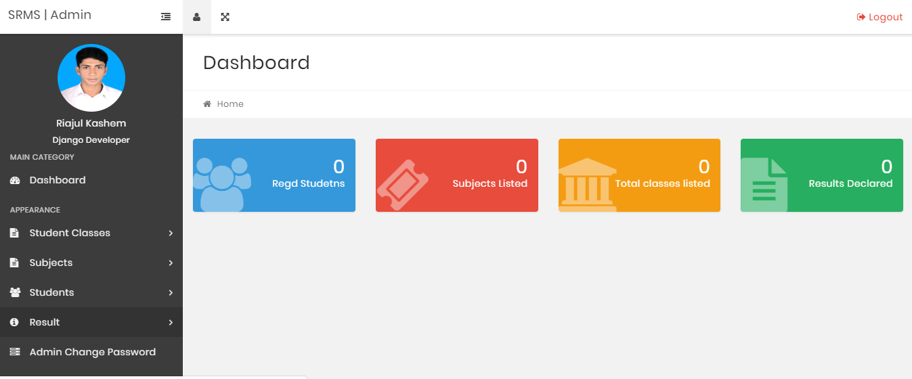

# SRMS
Student Result Management System

[](https://python.org)
[](https://djangoproject.com)

Student Result Management System is my first Django project!! It's single user application where user can CRUD (Create, Update, Delete) student, subject, subject combination and result. Then students can view there result and download this as PDF file. This project is live now in http://srms.riajul.me/ feel free to contribute this project.

**I'm available for freelance hire contact me in [Facebook](https://web.facebook.com/riajul.kashem/) or riajukashem@gmail.com **



## Running the Project Locally

First, clone the repository to your local machine:

```bash
git clone https://github.com/RiajulKashem/SRMS.git
```
Now enter the directory:  

```bash
cd SRMS
```
Now create a virtual machine:  
```bash
virtualenv venv  
source venv/bin/activate
```
Install the requirements:

```bash
pip install -r requirments.txt
```

Apply the migrations:

```bash
python manage.py makemigrations
python manage.py migrate
```

Finally, run the development server:

```bash
python manage.py runserver
```

The project will be available at **127.0.0.1:8000**.

## License

The source code is released under the [MIT License](https://github.com/RiajulKashem/SRMS/blob/master/LICENSE).
## Conclusion
Thanks for reading this. At last **Don't forget to givee a star 🌟!!**
